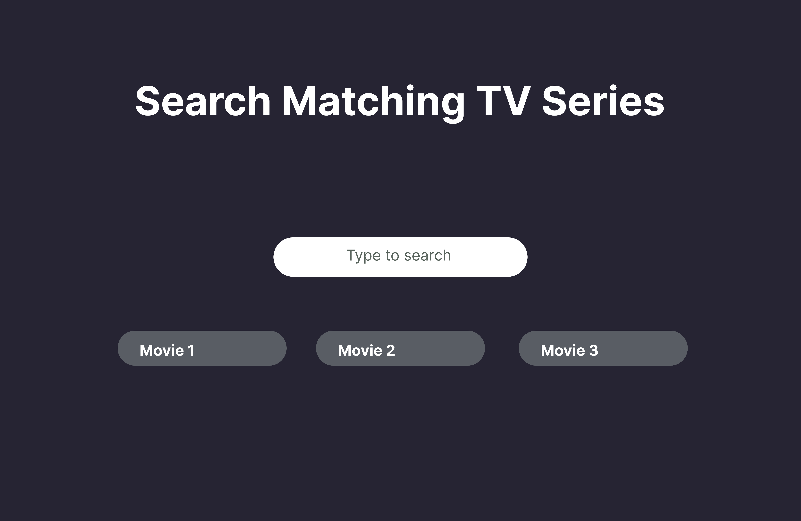

# Search Engin Using MERN Stack

 

## Introduction
Welcome to TV Show Search, a simple web application designed for frontend users to search for their favorite TV series. This project utilizes React.js for the frontend, Node.js and Express.js for the backend, and MongoDB as the database. The main functionality of the application is to allow users to search for TV series by typing a name or part of the name into an input box and clicking the search button. The backend server handles the search query and retrieves the three best matching TV series names from the provided data stored in a MongoDB database.

## FontEnd UI

 

## Features

Input box for users to enter the name or part of the name of a TV series.
Display of the three best matching TV series names.
Utilizes MongoDB to store and retrieve TV series data.
Responsive and user-friendly interface.

